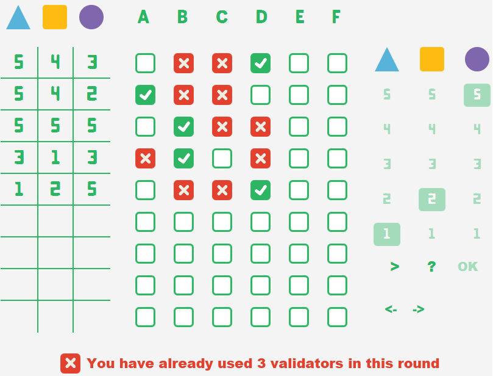
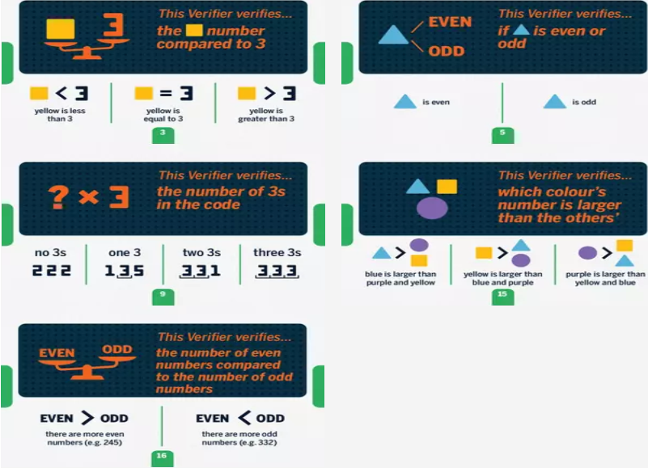
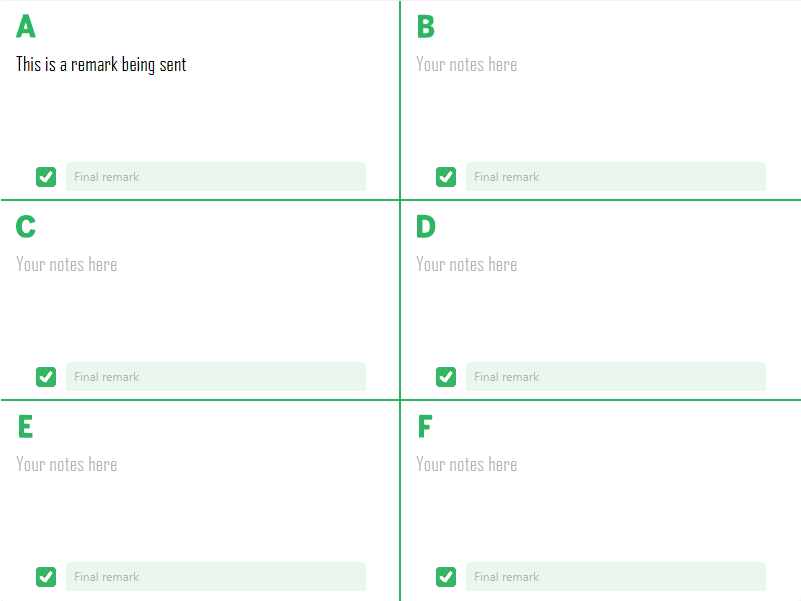

# Turing Machine Game
A JavaFX game where you deduce the secret code by questioning verifiers, 
inspired by the Turing Machine board game.

## Table of Contents
- [About](#about)
- [Screenshot](#screenshot)
- [Features](#features)
- [Tech Stack](#tech-stack)
- [Getting Started](#getting-started)
  - [Prerequisites](#prerequisites)
  - [Installation](#installation)
- [Usage / Examples](#usage--examples)
  - [Main Game View](#main-game-view)
  - [Verifiers](#verifiers)
  - [Notes Panel](#notes-panel)

## About
Turing Machine Game is a JavaFX application that recreates the deduction 
board game where players must discover a hidden 3-digit code. By proposing 
combinations and testing them against verifiers, the app provides a simple 
GUI to enter codes, receive feedback, and track deductions, allowing for 
both solo and cooperative play.

## Screenshot
<p align="center"> 
  
</p> 
<p align="center"> 
  <em>Main GUI showing the code table, verifiers’ results, and deduction grid</em>
</p>

## Features
- **Code Deduction Gameplay**
  - Enter 3-digit code proposals made of different colors and numbers.
  - Question verifiers to test if your proposal passes their hidden criteria.

- **Verifier System**
  - Each verifier checks a unique logical rule (e.g., parity, comparisons, sums).
  - Feedback helps narrow down possibilities until only one valid code remains.

- **Interactive GUI**
  - Clean JavaFX interface with code grid, verifier responses, and deduction tracking.
  - Visual feedback with ✅/❌ results for each verifier.

- **Game Modes**
  - Play solo to solve puzzles step by step.
  - Cooperative mode allos multiple players to collaborate.
  - Built-in notes panel lets you record deductions and final remarks for each verifier.

## Tech Stack
<p align="center">  
    
    
    
</p>

## Getting Started

### Prerequisites
Make sure you have the following installed on your system:

- **Java JDK 21** – required since the project is compiled with Java 21 [Download here](https://www.oracle.com/europe/java/technologies/downloads/)
- **Apache Maven** [Download here](https://maven.apache.org/download.cgi)
- **Git**

### Installation
- Clone the project: ```git clone https://github.com/souhaibelh/Turing-Machine-Game.git```
- Open the project's root folder: ```cd TuringMachineProject```
- Compile the project with maven: ```mvn compile```
- Run ```mvn javafx:run```, levels are loaded from CSV file bundled with the project, no need for database.

### Usage / Examples
- When you open the app, you will first see the **Level Selector**:
  - Choose a specific level from the list, or let the app **randomize** one for you.
  - Once a level is selected, the main game view opens.

#### Main Game View
- Scroll down to see the **Verifiers** at the top and the **Code Grid** below.
- Use the on-screen **keyboard** on the right to select a 3-digit code (colors + numbers).
- Click **OK** to submit your proposal.  
- Use **Undo (←)** and **Redo (→)** buttons to quickly adjust your choices.  
- Click **Next Round (>)** to progress to the next step.

<p align="center">
  <br/>
</p>
<p align="center">
  <em>Main game view showing the verifier panel, code grid, and keyboard for code entry</em>
</p>

#### Verifiers
- Click on **A, B, C, D, E, F** to run your selected code against the corresponding verifiers.
- Each verifier gives a ✅ (pass) or ❌ (fail) depending on whether your code respects their hidden rule.
- Click **?** to test your current code and check if you have won or lost.

<p align="center">
  <br/>
</p>
<p align="center">
  <em>Verifier panel showing criteria checks and results</em>
</p>

#### Notes Panel
- At the bottom of the view, you can use the **Notes section** to keep track of deductions.
- Record verifier feedback, eliminate possibilities, and refine your strategy.
- This helps you narrow down the only code that satisfies all active verifiers.

<p align="center">
  <br/>
</p>
<p align="center">
  <em>Notes panel for writing deductions and tracking verifier rules</em>
</p>
